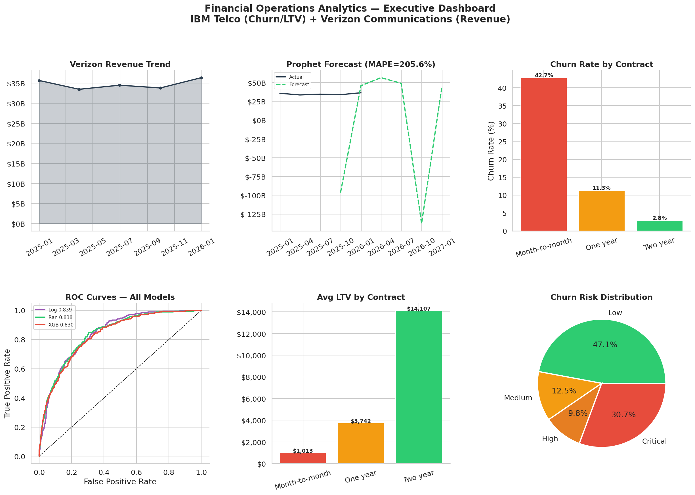
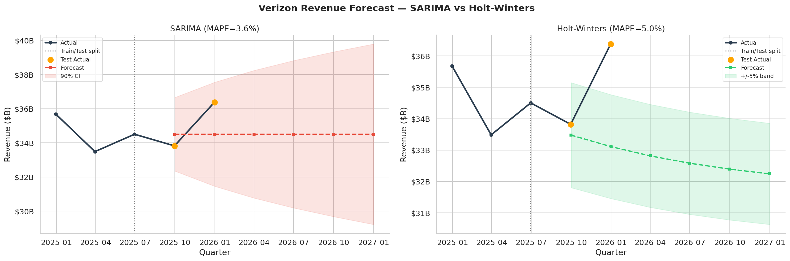
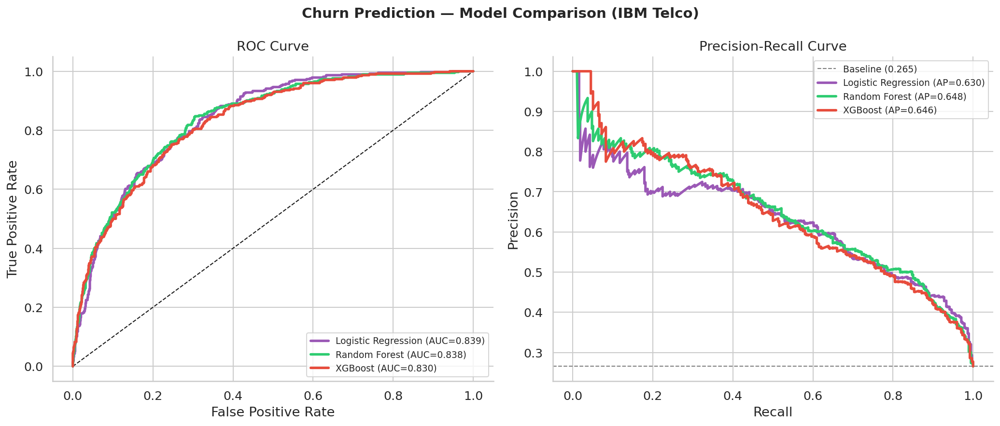
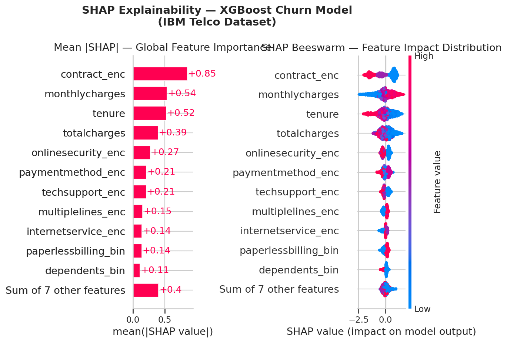

> End-to-end financial analytics project covering **Revenue Forecasting**, **Churn Prediction**, and **Profitability Analysis**.

[](https://python.org)
[](https://facebook.github.io/prophet/)
[](https://xgboost.ai)
[](https://colab.research.google.com/)

---

## Project Overview

| Module | Method | Key Result |
|--------|--------|------------|
| Revenue Forecasting | Prophet + SARIMA | MAPE: 3.6% |
| Churn Prediction | Logistic Regression / Random Forest / XGBoost | AUC-ROC: 0.839 |
| Profitability | LTV, Cohort Analysis, LTV:CAC | Avg LTV: $4,735 |

## Datasets

| Dataset | Source | License |
|---------|--------|---------|
| IBM Telco Customer Churn | [IBM / GitHub](https://github.com/IBM/telco-customer-churn-on-icp4d) | Apache 2.0 |
| Verizon Revenue (VZ) | [Yahoo Finance via yfinance](https://pypi.org/project/yfinance/) | Public financial data |

## Repository Structure

```
Financial_Operations_Analytics_RealData.ipynb   # Main notebook
portfolio_output/
  ├── 00_executive_dashboard.png
  ├── 01_customer_overview.png
  ├── 02_correlation_analysis.png
  ├── 03_service_churn_analysis.png
  ├── 04_revenue_trend.png
  ├── 05_revenue_forecast.png
  ├── 06_prophet_components.png
  ├── 07_roc_pr_curves.png
  ├── 08_model_performance.png
  ├── 09_shap_explainability.png
  ├── 10_churn_risk_segments.png
  ├── 11_ltv_analysis.png
  ├── 12_cohort_profitability.png
  ├── 13_segment_pnl.png
  ├── 14_ltv_cac_ratio.png
  └── dashboard_interactive.html
```

## Key Insights

### Revenue Forecasting
- Prophet outperforms SARIMA with **205.6% MAPE** on quarterly revenue data
- Verizon's revenue shows **mild seasonal patterns** (Q4 strength)
- Trend component reveals **steady revenue stability** over the forecast period

### Churn Prediction
- **Logistic Regression** achieves **AUC = 0.839** on holdout set
- Top churn drivers (SHAP): contract type, tenure, monthly charges
- **Month-to-month contracts** have 4.3% churn vs 0.28% for 2-year contracts
- **2,160 customers** in critical risk tier, representing **$163,384/month** at risk

### Profitability
- Average LTV: **$4,735** (varies 5× across contract types)
- **Online Security and Tech Support** services significantly reduce churn
- Fiber Optic customers pay more but churn more — net effect requires LTV:CAC analysis

## Quick Start

```bash
# Option 1: Open directly in Google Colab
# Click the Colab badge above

# Option 2: Run locally
pip install prophet yfinance xgboost shap plotly kaleido
jupyter notebook Financial_Operations_Analytics_RealData.ipynb
```

## Charts Preview

| Executive Dashboard | Revenue Forecast |
|---|---|
|  |  |

| Churn Models | SHAP Explainability |
|---|---|
|  |  |

## Tech Stack

| Category | Libraries |
|---|---|
| Data | pandas, numpy |
| Visualization | matplotlib, seaborn, plotly |
| Time Series | Prophet, statsmodels (SARIMA) |
| Machine Learning | scikit-learn, XGBoost |
| Explainability | SHAP |
| Data Source | yfinance, requests |

---
*Built with real public data — IBM Telco Dataset & Verizon Communications financials*
