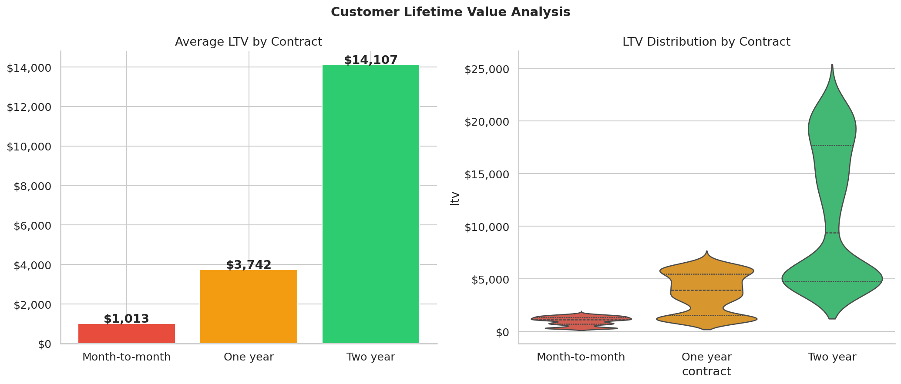
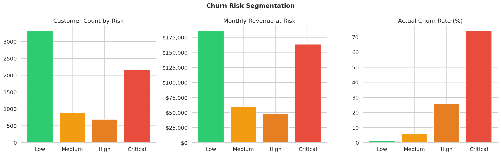

# Financial Operations Analytics
### End-to-End Project: Revenue Forecasting · Churn Prediction · Profitability Analysis

   

## Project Overview

This project answers 3 critical business questions using **real public data**:

| Question | Method | Result |
|----------|--------|--------|
| What revenue will we make next quarter? | SARIMA + Holt-Winters | MAPE: **3.59%** |
| Which customers will leave? | Logistic Regression / Random Forest / XGBoost | AUC: **0.839** |
| Which customers are most profitable? | LTV · Cohort Analysis · LTV:CAC | Avg LTV: **$4,735** |

## Datasets

| Dataset | Source | License |
|---------|--------|---------|
| IBM Telco Customer Churn | [IBM GitHub](https://github.com/IBM/telco-customer-churn-on-icp4d) | Apache 2.0 |
| Verizon Communications (VZ) | [Yahoo Finance via yfinance](https://pypi.org/project/yfinance/) | Public financial data |

## Key Results

### Revenue Forecasting (Verizon — Real Quarterly Data)
- Latest Verizon quarterly revenue: **$36.38 Billion**
- **SARIMA** → MAPE **3.59%** ← Best Model — only $1.28B off per quarter
- **Holt-Winters** → MAPE **5.01%**
- Forecast horizon: **4 quarters ahead**

### Churn Prediction (IBM Telco — 7,043 Real Customers)
- Overall churn rate: **26.5%** (1,869 customers churned)
- Best model: **Logistic Regression (AUC = 0.839)**
- Critical risk customers: **2,160 customers**
- Revenue at risk: **$163,384 / month**
- Top churn drivers: contract type, tenure, monthly charges, tech support

### Profitability Analysis
- Avg Monthly Revenue per customer: **$65**
- Gross Margin: **65%**
- Average Customer LTV: **$4,735**
- Two-year contract customers are worth **15x more** than month-to-month

## Project Structure

    Financial_Operations_Analytics/
    ├── Financial_Operations_Analytics_RealData.ipynb
    ├── README.md
    └── portfolio_output/
        ├── 00_executive_dashboard.png
        ├── 01_customer_overview.png
        ├── 02_correlation_analysis.png
        ├── 03_service_churn_analysis.png
        ├── 04_revenue_trend.png
        ├── 05_revenue_forecast.png
        ├── 06_hw_fit_analysis.png
        ├── 07_roc_pr_curves.png
        ├── 08_model_performance.png
        ├── 09_shap_explainability.png
        ├── 10_churn_risk_segments.png
        ├── 11_ltv_analysis.png
        ├── 12_cohort_profitability.png
        ├── 13_segment_pnl.png
        ├── 14_ltv_cac_ratio.png
        └── dashboard_interactive.html

## Charts Preview

| Executive Dashboard | Revenue Forecast |
|---|---|
|  |  |

| Churn Model ROC Curves | SHAP Explainability |
|---|---|
|  |  |

| LTV Analysis | Churn Risk Segments |
|---|---|
|  |  |

## Quick Start

    # Option 1 — Open in Google Colab
    # Click the Colab badge above

    # Option 2 — Run locally
    pip install xgboost shap plotly yfinance statsmodels scikit-learn
    jupyter notebook Financial_Operations_Analytics_RealData.ipynb

## Business Insights

1. **Month-to-month customers churn at 42%** vs only 2.8% for 2-year contracts
2. **New customers (0-6 months) leave the fastest** — improve onboarding
3. **Online security and tech support reduce churn** — bundle them early
4. **2,160 critical-risk customers** need immediate retention outreach
5. **SARIMA forecasts Verizon revenue with 3.59% error** — reliable for budget planning

## Tech Stack

| Category | Tools |
|----------|-------|
| Data Manipulation | pandas, numpy |
| Visualization | matplotlib, seaborn, plotly |
| Time Series | statsmodels (SARIMA, Holt-Winters) |
| Machine Learning | scikit-learn, XGBoost |
| Explainability | SHAP |
| Data Sources | yfinance, requests |
| Platform | Google Colab |

*Built with real public data — IBM Telco Dataset and Verizon Communications financials*

---

Copy everything from **# Financial Operations Analytics** to the last line and paste into GitHub README editor.
